# Samples for barcode type azteccode

## Sample 0
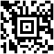

73939417696202725635895512836438

## Sample 1
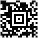

96511491998949851142451714609288

## Sample 2
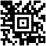

74497877690578905428756183446485

## Sample 3
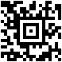

27047778549195971483163387404634

## Sample 4
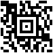

21473001216111777386928363265168

## Sample 5
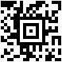

21103608307490597234068152158643

## Sample 6
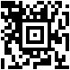

38110874350788756833413405112679

## Sample 7
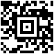

91570429159330743755995641251849

## Sample 8
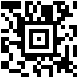

26455656092164011032136041509145

## Sample 9
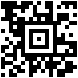

96205152507804581855664255057159

## Sample 10
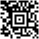

47706996076308831599084217155134

## Sample 11
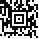

53048880026680970848731362364476

## Sample 12
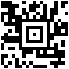

52619251051132180068556237611820

## Sample 13
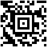

61903367356557201650450788140628

## Sample 14
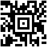

24415675583241164508771938536641

## Sample 15
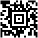

81423954081962075959991715264265

## Sample 16
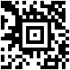

75216233436615369199100875497022

## Sample 17
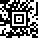

10357608958986859510253303107983

## Sample 18
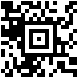

97577209413942694560363492011582

## Sample 19
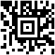

75076816200706272584351104245577

