# Samples for barcode type code128

## Sample 0
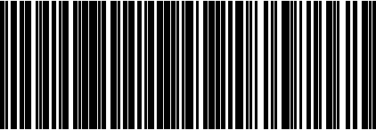

52154699431319488144008774790449

## Sample 1
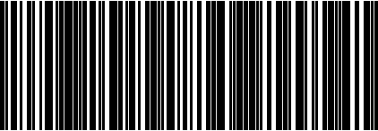

37859012931944800632622333579844

## Sample 2
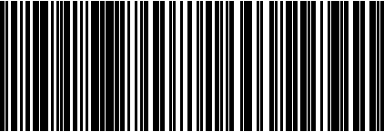

14881582901043403817659673165494

## Sample 3

99416694805008402024478630860682

## Sample 4
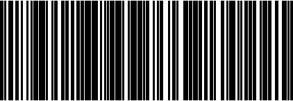

10993400898899945465712302748730

## Sample 5
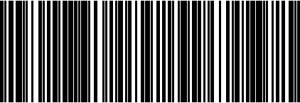

97732248957819365102941665742660

## Sample 6
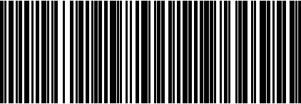

12146574290097049831140257714293

## Sample 7

64351299964951724741787180745772

## Sample 8

10232946322972904003108357318521

## Sample 9
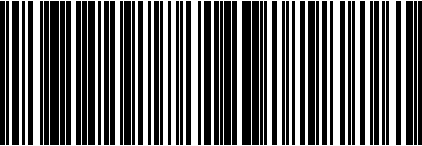

72903226500739631745773804247438

## Sample 10
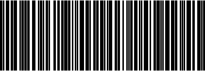

52305671022780552246411280448058

## Sample 11
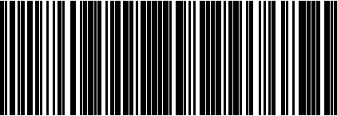

12397156541327235186472151706539

## Sample 12
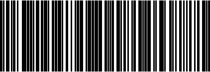

69911755514152235943064342937308

## Sample 13
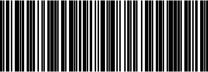

79324144497914078583687147449457

## Sample 14
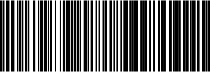

56715054689149073409859636687455

## Sample 15
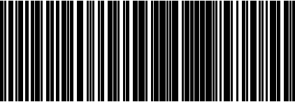

15510054623457439860962360823585

## Sample 16
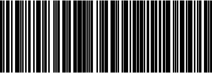

79038561434377704297832314026285

## Sample 17
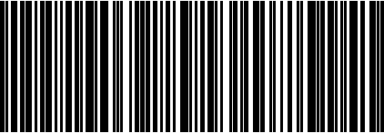

21211784626800068622674340387922

## Sample 18
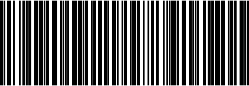

68435462935412493445057595596489

## Sample 19
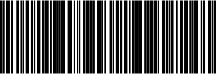

74171726928844496616265853473618

