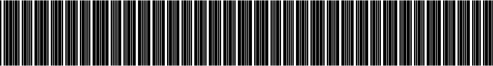
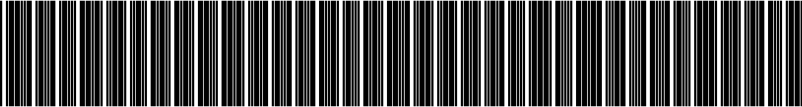

# Samples for barcode type code39

## Sample 0

98044111903032539312003685287876

## Sample 1

13334143167787540980789985291133

## Sample 2

10908193523826191553902551239863

## Sample 3

15378872447654828171651130270305

## Sample 4

39218110130283704290280593139776

## Sample 5

84096969820762351914242694309157

## Sample 6

12246800957003207600516650538449

## Sample 7

85776880149272187951904166805290

## Sample 8

66366519003837821072840061571670

## Sample 9

92231323804439288586549654567473

## Sample 10

90820516615754900788198857876331

## Sample 11

84188032669944409354786294214992

## Sample 12

47344581016908204948062257212476

## Sample 13

50419589883397243033829515339360

## Sample 14

40750392283229028143386535027122

## Sample 15

99108378371011374894205601969592

## Sample 16

39823455504486625204778908921020

## Sample 17

66102260458736178631666800742998

## Sample 18

29035682445532115791203432000435

## Sample 19

99011440019968402181975033697816

