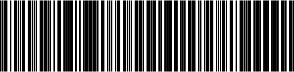

# Samples for barcode type interleaved2of5

## Sample 0

88733363555345743783199767825295

## Sample 1

55164282697924182222858040899973

## Sample 2

42333754760984418347974975172630

## Sample 3

47620928114548377434563807626049

## Sample 4

82971975569039621212618433366779

## Sample 5

71435245674989725331180536112413

## Sample 6

36109074228186617420482086410676

## Sample 7

71598827092920430143762763358117

## Sample 8

86010855860625461682580968747204

## Sample 9

53313711735605025400090847219494

## Sample 10

54319668364746883410546667741916

## Sample 11

41243588979472691498230754057820

## Sample 12

87701227163422394144954280773200

## Sample 13

45383254927915159103631763070925

## Sample 14

28818620014050926811615294025539

## Sample 15

41530801967519643320984561847247

## Sample 16

49694895082838075674582780642026

## Sample 17

87553747977637655495084721391898

## Sample 18

16057631585092697876139470743514

## Sample 19

47474110543991981011409315469316

