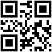

# Samples for barcode type qrcode

## Sample 0

81836714268823501391294881527773

## Sample 1

86667827571402508597016556004980

## Sample 2

59245019133852553006210857741020

## Sample 3

44797705196333772526038415068723

## Sample 4

51978480945813741094475312053192

## Sample 5

49350024902302201871787713124237

## Sample 6

47427139642365142224437881946132

## Sample 7

73138786849971865906574929353153

## Sample 8

96517751851692088382169980529715

## Sample 9

57456844749417431008233030328891

## Sample 10

73641796097030060313613902048703

## Sample 11

40024174800018689360046779065752

## Sample 12

75819142031008219746531089736347

## Sample 13

26355790828210995075882275008810

## Sample 14

44010287059998514172143698948661

## Sample 15

61822320060225779762238570891124

## Sample 16

37660749216723912734054477251251

## Sample 17

29141500804781657153753225723879

## Sample 18

14306835051037045772857442460728

## Sample 19

70784944797364259946546505590869

